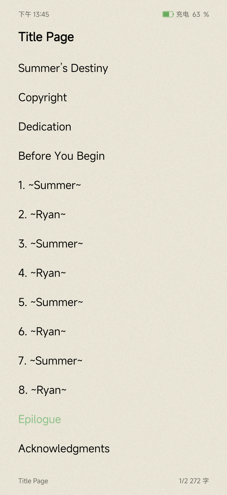
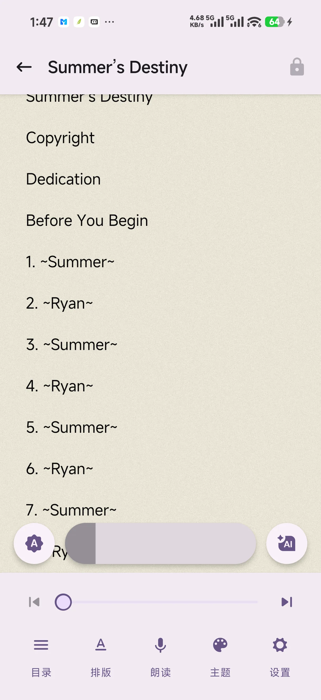
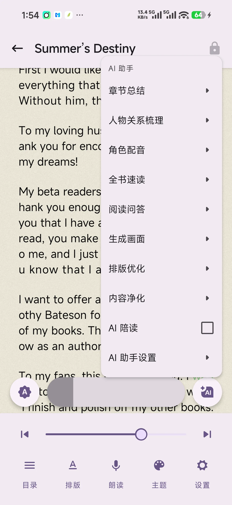
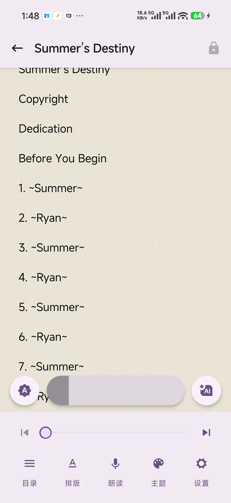

# 墨伴 · 使用说明

> 在线阅读（图文完整版）：**https://jason-wam.github.io/MoBan-Docs/**
>
> 问题反馈：[提交 Issue](https://github.com/Jason-wam/MoBan-Docs/issues/new)

墨伴是一款 Android 本地 + 在线阅读应用，支持书源、AI 智能伴读、语音朗读、划线笔记、多格式书籍导入。

## 快速开始

三种方式把书加入书架：

1. **导入本地书籍** —— 空书架点击「导入本地书籍或字体」，或右上角悬浮按钮，支持 TXT / EPUB / MOBI / AZW3 / FB2 / CBZ / CBR / CB7
2. **书源搜书** —— 添加书源后直接在线搜索、换源
3. **局域网传输** —— 电脑浏览器访问同一 Wi-Fi 下的网页端拖拽上传

| 导入菜单 |
|:---:|
|  |

## 主界面导览

| 书架 | 分类 | 统计 | 我的 |
|:---:|:---:|:---:|:---:|
|  |  |  |  |

## 阅读体验

- **六种翻页动画**：滑盖 / 交互 / 平滑（三页流水线连续交互，前进回退跟手）、垂直、仿真、禁用
- **排版与主题**：字体、字号、行距、缩进自由调节，多套配色 + 深色模式

| 阅读页 | 阅读菜单 | 翻页动画 | 主题 |
|:---:|:---:|:---:|:---:|
|  |  |  |  |

## AI 智能助手 · 语音朗读

支持配置任意兼容接口（密钥统一在「密钥管理」归集），AI 伴读与在线大模型朗读双引擎：

| 功能 | 说明 |
|:---|:---|
| 章节总结 / 全书速读 | 快速了解剧情脉络 |
| 人物关系 | 自动整理角色关系图 |
| 角色配音 | 结合 TTS 朗读的角色化语音 |
| 阅读问答 / 划词问 AI | 选中文字直接提问 |
| 生成画面 | 文生图，为段落配图 |
| 排版优化 / 内容净化 | 修正错字、去除广告水印 |
| 语音朗读 | 系统 TTS / 在线大模型双引擎，语速音色可调 |

| AI 面板 | 朗读面板 |
|:---:|:---:|
|  |  |

## 划线 · 笔记 · 词典

- 长按选字/选段，支持划线、批注、复制、问 AI
- 点按词语直接查词典（成语 / 歇后语）

## 书源与在线内容

- **书源管理**：导入 / 导出 / 启停 / 排序，内置净化规则去除广告
- **多源搜索**：一书多源，一键换源
- **在线内容**：WebDAV、Z-Library、古腾堡、OPDS
- **AI 书源识别**：粘贴小说页面链接，AI 自动生成书源规则
- **插件**：扩展在线内容解析能力

| 书源管理 |
|:---:|
|  |

## 创作教程

- 书源创建教程：https://github.com/Jason-wam/moban-web-source-demo
- 插件创建教程：https://github.com/Jason-wam/moban-plugin-demo

## 数据与隐私

- 全部数据本地存储（Room 数据库 + 本地文件）
- 支持 WebDAV 备份
- 智能阅读统计：停留不翻页自动暂停计时，避免虚假数据
